# WORKFLOW para o GITHUB ACTIONS

A estrutura:

```text
teste-contrato/
├── .github/
│   └── workflows/
│       └── contract-tests.yml
│
├── teste-contrato-cypress/
├── teste-contrato-playwright/
├── teste-contrato-robot/
└── teste-contrato-postman/
```

## Workflow completo

Crie:

```text
.github/workflows/contract-tests.yml
```

```yaml
name: Contract Tests

on:
  push:
    branches:
      - main
      - master

  pull_request:

jobs:

  # ============================================================
  # CYPRESS
  # ============================================================

  cypress:
    name: Cypress Contract Test
    runs-on: ubuntu-latest

    steps:
      - name: Checkout
        uses: actions/checkout@v4

      - name: Setup Node
        uses: actions/setup-node@v4
        with:
          node-version: 20

      - name: Install dependencies
        working-directory: teste-contrato-cypress
        run: npm ci

      - name: Run Cypress
        id: test
        continue-on-error: true
        working-directory: teste-contrato-cypress
        run: npx cypress run

      - name: Save result
        if: always()
        run: |
          mkdir -p ../results

          if [ "${{ steps.test.outcome }}" = "success" ]; then
            echo "ok" > ../results/cypress.txt
          else
            echo "failed" > ../results/cypress.txt
          fi

      - name: Upload Cypress result
        if: always()
        uses: actions/upload-artifact@v4
        with:
          name: cypress-result
          path: results/cypress.txt


  # ============================================================
  # PLAYWRIGHT
  # ============================================================

  playwright:
    name: Playwright Contract Test
    runs-on: ubuntu-latest

    steps:
      - name: Checkout
        uses: actions/checkout@v4

      - name: Setup Node
        uses: actions/setup-node@v4
        with:
          node-version: 20

      - name: Install dependencies
        working-directory: teste-contrato-playwright
        run: npm ci

      - name: Install Playwright browsers
        working-directory: teste-contrato-playwright
        run: npx playwright install --with-deps

      - name: Run Playwright
        id: test
        continue-on-error: true
        working-directory: teste-contrato-playwright
        run: npx playwright test

      - name: Save result
        if: always()
        run: |
          mkdir -p ../results

          if [ "${{ steps.test.outcome }}" = "success" ]; then
            echo "ok" > ../results/playwright.txt
          else
            echo "failed" > ../results/playwright.txt
          fi

      - name: Upload Playwright result
        if: always()
        uses: actions/upload-artifact@v4
        with:
          name: playwright-result
          path: results/playwright.txt


  # ============================================================
  # ROBOT FRAMEWORK
  # ============================================================

  robot:
    name: Robot Framework Contract Test
    runs-on: ubuntu-latest

    steps:
      - name: Checkout
        uses: actions/checkout@v4

      - name: Setup Python
        uses: actions/setup-python@v5
        with:
          python-version: "3.12"

      - name: Install dependencies
        working-directory: teste-contrato-robot
        run: pip install -r requirements.txt

      - name: Run Robot Framework
        id: test
        continue-on-error: true
        working-directory: teste-contrato-robot
        run: robot tests/contrato/usuario.robot

      - name: Save result
        if: always()
        run: |
          mkdir -p ../results

          if [ "${{ steps.test.outcome }}" = "success" ]; then
            echo "ok" > ../results/robot.txt
          else
            echo "failed" > ../results/robot.txt
          fi

      - name: Upload Robot result
        if: always()
        uses: actions/upload-artifact@v4
        with:
          name: robot-result
          path: results/robot.txt


  # ============================================================
  # POSTMAN / NEWMAN
  # ============================================================

  postman:
    name: Postman Contract Test
    runs-on: ubuntu-latest

    steps:
      - name: Checkout
        uses: actions/checkout@v4

      - name: Setup Node
        uses: actions/setup-node@v4
        with:
          node-version: 20

      - name: Install Newman
        run: npm install -g newman

      - name: Run Newman
        id: test
        continue-on-error: true
        working-directory: teste-contrato-postman
        run: newman run collections/teste-contrato-usuario.postman_collection.json

      - name: Save result
        if: always()
        run: |
          mkdir -p ../results

          if [ "${{ steps.test.outcome }}" = "success" ]; then
            echo "ok" > ../results/postman.txt
          else
            echo "failed" > ../results/postman.txt
          fi

      - name: Upload Postman result
        if: always()
        uses: actions/upload-artifact@v4
        with:
          name: postman-result
          path: results/postman.txt


  # ============================================================
  # SUMMARY
  # ============================================================

  summary:
    name: Contract Tests Summary
    runs-on: ubuntu-latest

    needs:
      - cypress
      - playwright
      - robot
      - postman

    if: always()

    steps:

      - name: Download Cypress result
        uses: actions/download-artifact@v4
        with:
          name: cypress-result
          path: results/cypress

      - name: Download Playwright result
        uses: actions/download-artifact@v4
        with:
          name: playwright-result
          path: results/playwright

      - name: Download Robot result
        uses: actions/download-artifact@v4
        with:
          name: robot-result
          path: results/robot

      - name: Download Postman result
        uses: actions/download-artifact@v4
        with:
          name: postman-result
          path: results/postman

      # ----------------------------------------------------------
      # Gerar summary.json
      # ----------------------------------------------------------

      - name: Generate JSON report
        run: |
          mkdir -p results

          CYPRESS=$(cat results/cypress/cypress.txt)
          PLAYWRIGHT=$(cat results/playwright/playwright.txt)
          ROBOT=$(cat results/robot/robot.txt)
          POSTMAN=$(cat results/postman/postman.txt)

          if [ "$CYPRESS" = "ok" ] && \
             [ "$PLAYWRIGHT" = "ok" ] && \
             [ "$ROBOT" = "ok" ] && \
             [ "$POSTMAN" = "ok" ]; then
            OVERALL="ok"
          else
            OVERALL="failed"
          fi

          cat > results/summary.json << EOF
          {
            "cypress": "$CYPRESS",
            "playwright": "$PLAYWRIGHT",
            "robot": "$ROBOT",
            "postman": "$POSTMAN",
            "overall": "$OVERALL"
          }
          EOF

          cat results/summary.json

      # ----------------------------------------------------------
      # GitHub Actions Job Summary
      # ----------------------------------------------------------

      - name: Generate GitHub Summary
        run: |
          CYPRESS=$(cat results/cypress/cypress.txt)
          PLAYWRIGHT=$(cat results/playwright/playwright.txt)
          ROBOT=$(cat results/robot/robot.txt)
          POSTMAN=$(cat results/postman/postman.txt)

          echo "# Contract Tests" >> $GITHUB_STEP_SUMMARY
          echo "" >> $GITHUB_STEP_SUMMARY
          echo "| Framework | Result |" >> $GITHUB_STEP_SUMMARY
          echo "|---|---|" >> $GITHUB_STEP_SUMMARY

          if [ "$CYPRESS" = "ok" ]; then
            echo "| Cypress | ✅ OK |" >> $GITHUB_STEP_SUMMARY
          else
            echo "| Cypress | ❌ FAILED |" >> $GITHUB_STEP_SUMMARY
          fi

          if [ "$PLAYWRIGHT" = "ok" ]; then
            echo "| Playwright | ✅ OK |" >> $GITHUB_STEP_SUMMARY
          else
            echo "| Playwright | ❌ FAILED |" >> $GITHUB_STEP_SUMMARY
          fi

          if [ "$ROBOT" = "ok" ]; then
            echo "| Robot Framework | ✅ OK |" >> $GITHUB_STEP_SUMMARY
          else
            echo "| Robot Framework | ❌ FAILED |" >> $GITHUB_STEP_SUMMARY
          fi

          if [ "$POSTMAN" = "ok" ]; then
            echo "| Postman / Newman | ✅ OK |" >> $GITHUB_STEP_SUMMARY
          else
            echo "| Postman / Newman | ❌ FAILED |" >> $GITHUB_STEP_SUMMARY
          fi

          echo "" >> $GITHUB_STEP_SUMMARY
          echo "## Overall" >> $GITHUB_STEP_SUMMARY

          if [ "$CYPRESS" = "ok" ] && \
             [ "$PLAYWRIGHT" = "ok" ] && \
             [ "$ROBOT" = "ok" ] && \
             [ "$POSTMAN" = "ok" ]; then

            echo "### ✅ All contract tests passed" >> $GITHUB_STEP_SUMMARY

          else

            echo "### ❌ One or more contract tests failed" >> $GITHUB_STEP_SUMMARY

          fi

      # ----------------------------------------------------------
      # Upload relatório
      # ----------------------------------------------------------

      - name: Upload contract test report
        if: always()
        uses: actions/upload-artifact@v4
        with:
          name: contract-test-summary
          path: results/summary.json

      # ----------------------------------------------------------
      # Falhar workflow se algum teste falhou
      # ----------------------------------------------------------

      - name: Validate final result
        run: |
          OVERALL=$(cat results/summary.json | grep '"overall"' | cut -d '"' -f 4)

          if [ "$OVERALL" != "ok" ]; then
            echo "Contract tests failed."
            exit 1
          fi

          echo "All contract tests passed."
```

### O resultado no GitHub

Se tudo estiver funcionando, o **Summary** da execução ficará aproximadamente assim:

```text
# Contract Tests

| Framework | Result |
|---|---|
| Cypress | ✅ OK |
| Playwright | ✅ OK |
| Robot Framework | ✅ OK |
| Postman / Newman | ✅ OK |

## Overall

### ✅ All contract tests passed
```

E o Artifact terá:

```json
{
  "cypress": "ok",
  "playwright": "ok",
  "robot": "ok",
  "postman": "ok",
  "overall": "ok"
}
```

### E se um teste quebrar?

Imagine que o Robot encontre uma quebra de contrato:

```text
Cypress        ✅ OK
Playwright     ✅ OK
Robot          ❌ FAILED
Postman        ✅ OK
```

O `summary.json` será:

```json
{
  "cypress": "ok",
  "playwright": "ok",
  "robot": "failed",
  "postman": "ok",
  "overall": "failed"
}
```

O **relatório será gerado mesmo assim**, mas o último step:

```text
Validate final result
```

executará:

```bash
exit 1
```

e o GitHub Actions ficará **vermelho**.

### Uma observação importante

Essa versão usa `continue-on-error: true` **de propósito**. Isso permite que, por exemplo, o Cypress falhe sem impedir que Playwright, Robot e Newman sejam executados.

Depois, o job `summary` usa:

```yaml
if: always()
```

para consolidar os resultados.

O desenho final fica:

```mermaid
flowchart TD
    A["Push / Pull Request"] --> B["Cypress"]
    A --> C["Playwright"]
    A --> D["Robot Framework"]
    A --> E["Postman / Newman"]

    B --> F["Resultado"]
    C --> G["Resultado"]
    D --> H["Resultado"]
    E --> I["Resultado"]

    F --> J["Summary"]
    G --> J
    H --> J
    I --> J

    J --> K["summary.json"]
    J --> L["GitHub Step Summary"]
    J --> M["Artifact"]

    K --> N{"Todos OK?"}

    N -->|Sim| O["✅ Workflow PASS"]
    N -->|Não| P["❌ Workflow FAIL"]
```



**Esse já é um pipeline de Contract Testing de verdade:** quatro frameworks independentes, execução paralela, consolidação dos resultados, relatório JSON, resumo visual no GitHub e falha do pipeline quando houver quebra de contrato.
