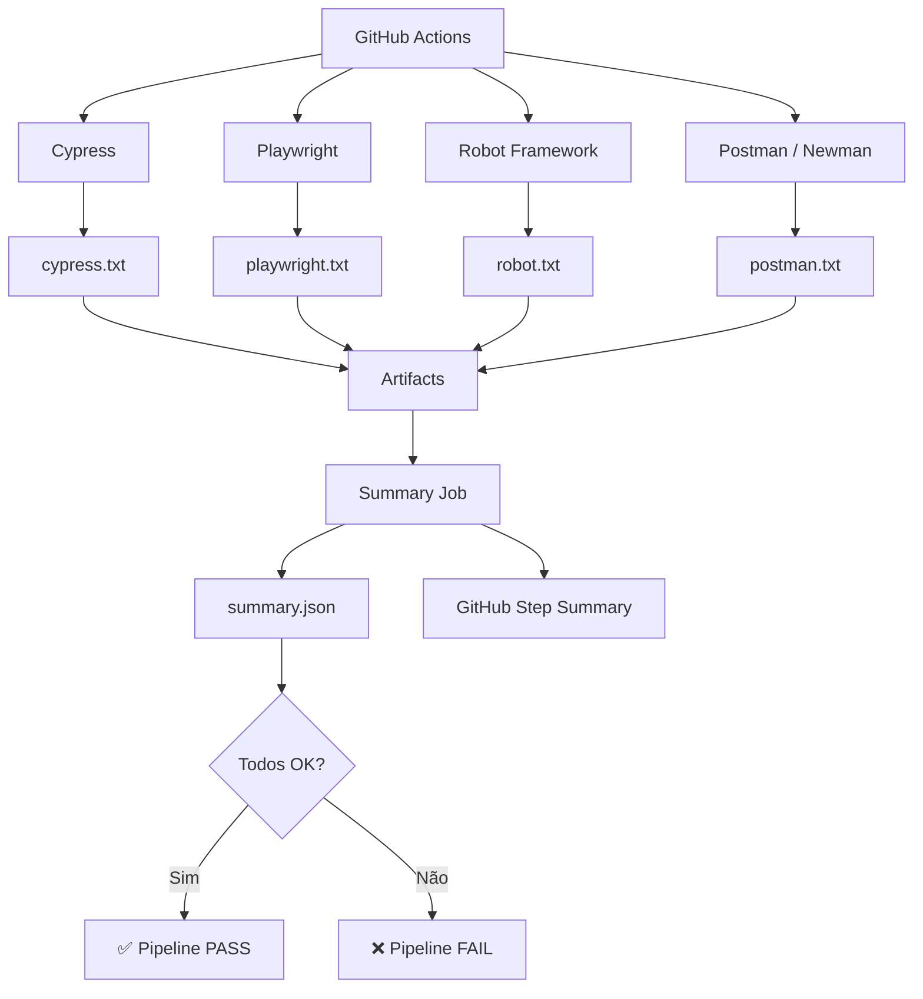

# WORKFLOW para o GITHUB ACTIONS

A estrutura:

```text
teste-contrato/
├── .github/
│   └── workflows/
│       └── contract-tests.yml
│
├── teste-contrato-cypress/
├── teste-contrato-playwright/
├── teste-contrato-robot/
└── teste-contrato-postman/
```

## Workflow completo


```text
.github/workflows/contract-tests.yml
```

### O resultado no GitHub

Se tudo estiver funcionando, o **Summary** da execução ficará aproximadamente assim:

```text
# Contract Tests

| Framework | Result |
|---|---|
| Cypress | ✅ OK |
| Playwright | ✅ OK |
| Robot Framework | ✅ OK |
| Postman / Newman | ✅ OK |

## Overall

### ✅ All contract tests passed
```

E o Artifact terá:

```json
{
  "cypress": "ok",
  "playwright": "ok",
  "robot": "ok",
  "postman": "ok",
  "overall": "ok"
}
```

### E se um teste quebrar?

Imagine que o Robot encontre uma quebra de contrato:

```text
Cypress        ✅ OK
Playwright     ✅ OK
Robot          ❌ FAILED
Postman        ✅ OK
```

O `summary.json` será:

```json
{
  "cypress": "ok",
  "playwright": "ok",
  "robot": "failed",
  "postman": "ok",
  "overall": "failed"
}
```

O **relatório será gerado mesmo assim**, mas o último step:

```text
Validate final result
```

executará:

```bash
exit 1
```

e o GitHub Actions ficará **vermelho**.

### Uma observação importante

Essa versão usa `continue-on-error: true` **de propósito**. Isso permite que, por exemplo, o Cypress falhe sem impedir que Playwright, Robot e Newman sejam executados.

Depois, o job `summary` usa:

```yaml
if: always()
```

para consolidar os resultados.

O desenho final fica:



**Esse já é um pipeline de Contract Testing de verdade:** quatro frameworks independentes, execução paralela, consolidação dos resultados, relatório JSON, resumo visual no GitHub e falha do pipeline quando houver quebra de contrato.
