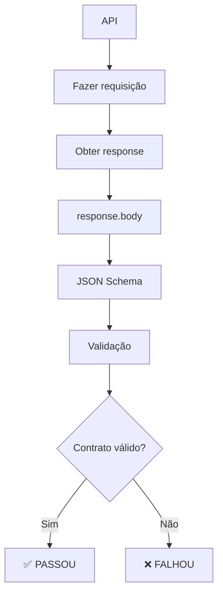
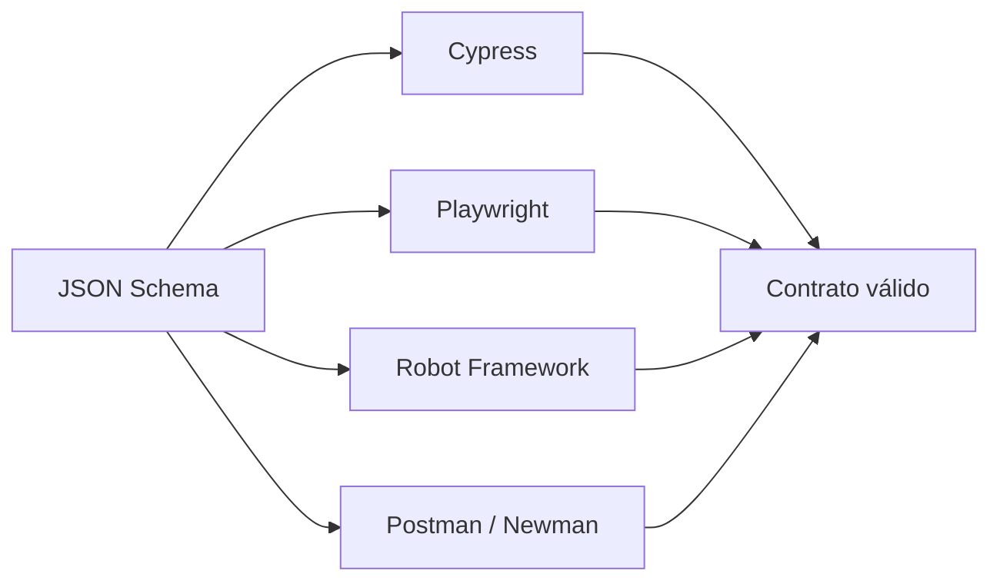
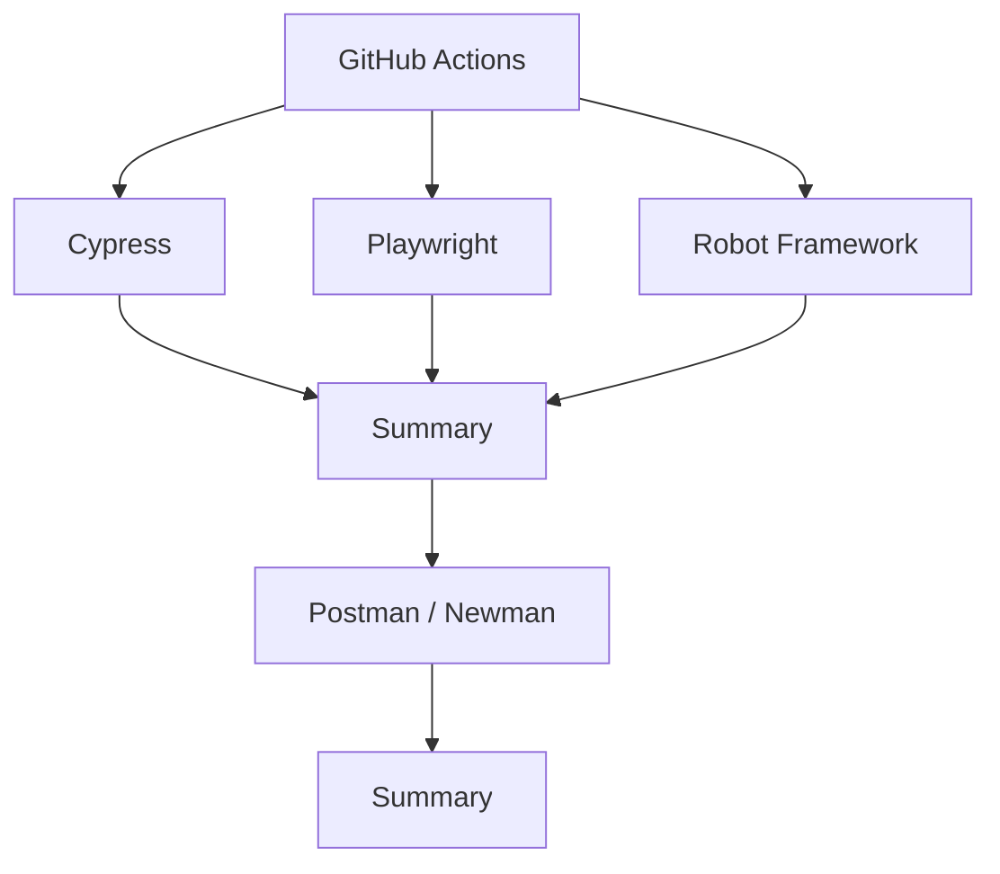
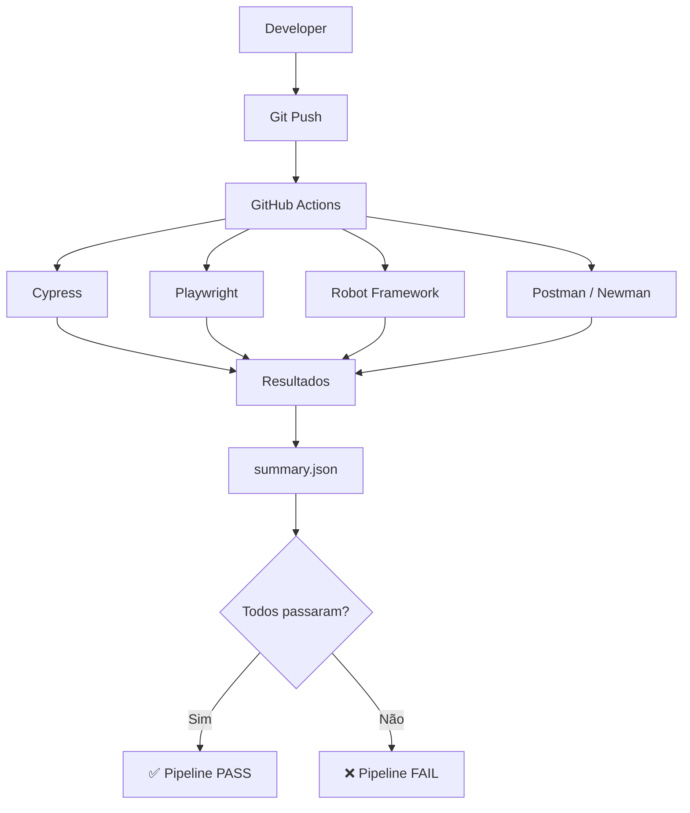
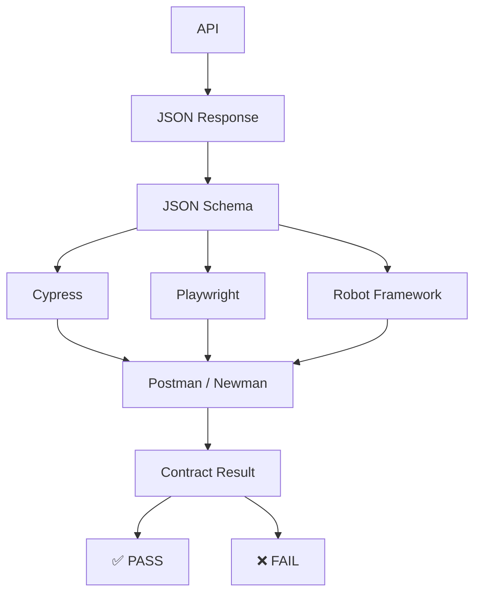

# Contract Testing — Cypress, Playwright, Robot Framework e Postman

Projeto de estudo e demonstração de **testes de contrato de APIs REST**, utilizando quatro ferramentas diferentes para validar o mesmo contrato de uma API.

O objetivo é demonstrar que o mesmo **JSON Schema** pode ser utilizado como fonte de verdade para validar a estrutura das respostas da API em diferentes ferramentas de automação.

---

## Objetivo

Validar o contrato de uma API REST através de:

* **Cypress**
* **Playwright**
* **Robot Framework**
* **Postman / Newman**

Todos os testes utilizam como referência um **JSON Schema**, verificando se a resposta da API mantém a estrutura esperada.

Neste projeto utilizamos a API pública do **ServeRest**.

Endpoint utilizado:

```text
GET https://serverest.dev/usuarios/0uxuPY0cbmQhpEz1
```

Resposta esperada:

```json
{
  "nome": "Fulano da Silva",
  "email": "fulano@qa.com",
  "password": "teste",
  "administrador": "true",
  "_id": "0uxuPY0cbmQhpEz1"
}
```

---

# O que é Contract Testing?

Um teste de contrato verifica se uma API continua respeitando o formato esperado pelos seus consumidores.

Neste projeto, o contrato é representado por um **JSON Schema**.

Por exemplo:

```json
{
  "type": "object",
  "required": [
    "nome",
    "email",
    "password",
    "administrador",
    "_id"
  ],
  "properties": {
    "nome": {
      "type": "string"
    },
    "email": {
      "type": "string",
      "format": "email"
    },
    "password": {
      "type": "string"
    },
    "administrador": {
      "type": "string"
    },
    "_id": {
      "type": "string"
    }
  },
  "additionalProperties": false
}
```

O schema define:

* quais propriedades são obrigatórias;
* qual o tipo de cada propriedade;
* quais formatos devem ser respeitados;
* se propriedades adicionais são permitidas.

---

# 🔄 Fluxo do teste



---

# Ferramentas utilizadas

## 1. Cypress

O **Cypress** é utilizado neste projeto para realizar a requisição HTTP e validar a resposta utilizando **Ajv**, um validador JSON Schema para JavaScript.

Exemplo conceitual:

```javascript
cy.request({
  method: 'GET',
  url: 'https://serverest.dev/usuarios/0uxuPY0cbmQhpEz1'
}).then((response) => {

  expect(response.status).to.eq(200)

  const validate = ajv.compile(schema)

  const valid = validate(response.body)

  expect(valid).to.be.true
})
```

### Responsabilidades

```text
Cypress
   │
   ├── Realiza GET
   ├── Valida HTTP 200
   ├── Obtém response.body
   └── Valida JSON Schema com Ajv
```

---

# 2. Playwright

O **Playwright** é utilizado para realizar testes automatizados e também possui suporte à realização de requisições HTTP através do seu **APIRequestContext**.

Neste projeto, utilizamos o Playwright para consumir a API e validar o contrato através do JSON Schema.

Fluxo:

```text
Playwright
    │
    ├── GET /usuarios/{id}
    ├── Valida status HTTP
    ├── Obtém JSON
    └── Valida JSON Schema
```

Uma vantagem é poder utilizar o mesmo ecossistema do Playwright para testes de API e testes end-to-end.

---

# 3. Robot Framework

O **Robot Framework** é uma ferramenta de automação baseada em uma abordagem orientada a palavras-chave (**keyword-driven**).

Neste projeto utilizamos:

* `RequestsLibrary`
* `JSONSchemaLibrary`

Exemplo conceitual:

```robot
*** Settings ***
Library    RequestsLibrary
Library    JSONSchemaLibrary

*** Variables ***
${BASE_URL}    https://serverest.dev
${USUARIO_ID}    0uxuPY0cbmQhpEz1

*** Test Cases ***
Deve validar o contrato da API de usuário

    ${response}=    GET
    ...    ${BASE_URL}/usuarios/${USUARIO_ID}

    Status Should Be    200    ${response}

    ${body}=    Set Variable    ${response.json()}

    Validate Json
    ...    ${SCHEMA}
    ...    ${body}
```

O Robot possui uma característica interessante para equipes de QA porque os testes podem ser escritos de maneira bastante próxima de uma linguagem natural.

---

# 4. Postman

O **Postman** é utilizado para criação e execução de testes de APIs.

Neste projeto, a Collection contém:

```text
GET - Buscar usuário
```

O teste verifica:

* status HTTP;
* contrato JSON;
* existência de campos importantes.

A validação do JSON Schema é realizada utilizando:

```javascript
pm.response.to.have.jsonSchema(schema)
```

---

# Newman

O **Newman** é o executor de Collections do Postman através da linha de comando.

Isso permite executar os testes do Postman em ambientes de CI/CD.

Exemplo:

```bash
newman run collections/teste-contrato-usuario.postman_collection.json
```

Dessa forma, uma Collection criada no Postman pode ser executada automaticamente no pipeline.

---

# Estrutura do projeto

A estrutura geral é organizada por ferramenta:

```text
teste-contrato/
│
├── .github/
│   └── workflows/
│       └── contract-tests.yml
│
├── teste-contrato-cypress/
│   ├── cypress/
│   ├── package.json
│   └── ...
│
├── teste-contrato-playwright/
│   ├── tests/
│   ├── package.json
│   └── ...
│
├── teste-contrato-robot/
│   ├── tests/
│   │   └── contrato/
│   │       └── usuario.robot
│   ├── schemas/
│   │   └── usuario.schema.json
│   └── requirements.txt
│
├── teste-contrato-postman/
│   ├── collections/
│   │   └── teste-contrato-usuario.postman_collection.json
│   └── teste-contrato-postman.md
│
└── README.md
```

---

# Comparação das ferramentas

| Ferramenta      | Linguagem               | Utilização      | Validação                  |
| --------------- | ----------------------- | --------------- | -------------------------- |
| Cypress         | JavaScript              | API / E2E       | Ajv                        |
| Playwright      | JavaScript / TypeScript | API / E2E       | JSON Schema / Ajv          |
| Robot Framework | Robot / Python          | API / Automação | JSONSchemaLibrary          |
| Postman         | JavaScript              | API             | JSON Schema                |
| Newman          | Node.js                 | CI/CD           | Executa Collection Postman |

---

# 🔄 Mesmo contrato, diferentes ferramentas

O principal conceito demonstrado neste projeto é:



A API é a mesma.

O contrato é o mesmo.

O que muda é a ferramenta utilizada para executar a validação.

---

# GitHub Actions

O projeto também possui um pipeline de **Continuous Integration** utilizando GitHub Actions.

O workflow executa os quatro testes:



Os testes são executados de maneira independente.

Isso significa que uma falha em uma ferramenta não impede que as outras sejam executadas.

---

# Relatório

Ao final da execução, o workflow gera um arquivo:

```text
results/summary.json
```

Exemplo:

```json
{
  "cypress": "ok",
  "playwright": "ok",
  "robot": "ok",
  "postman": "ok",
  "overall": "ok"
}
```

Caso algum teste falhe:

```json
{
  "cypress": "ok",
  "playwright": "ok",
  "robot": "failed",
  "postman": "ok",
  "overall": "failed"
}
```

O relatório é disponibilizado como **GitHub Actions Artifact**.

---

# GitHub Actions Summary

Além do JSON, o workflow apresenta um resumo visual na execução:

```text
Contract Tests

| Framework        | Result |
|------------------|--------|
| Cypress          | ✅ OK  |
| Playwright       | ✅ OK  |
| Robot Framework  | ✅ OK  |
| Postman / Newman | ✅ OK  |

Overall

✅ All contract tests passed
```

Se algum contrato for quebrado:

```text
Contract Tests

| Framework        | Result |
|------------------|--------|
| Cypress          | ✅ OK  |
| Playwright       | ✅ OK  |
| Robot Framework  | ❌ FAILED |
| Postman / Newman | ✅ OK  |

Overall

❌ One or more contract tests failed
```

---

# Executando localmente

## Cypress

```bash
cd teste-contrato-cypress

npm install

npx cypress run
```

---

## Playwright

```bash
cd teste-contrato-playwright

npm install

npx playwright install

npx playwright test
```

---

## Robot Framework

```bash
cd teste-contrato-robot

pip install -r requirements.txt

robot tests/contrato/usuario.robot
```

---

## Postman / Newman

```bash
cd teste-contrato-postman

newman run collections/teste-contrato-usuario.postman_collection.json
```

---

# Execução em CI/CD

A ideia do projeto é que os mesmos testes executados localmente possam ser utilizados no pipeline.



---

# O que este projeto demonstra

Este projeto demonstra conhecimentos em:

* API Testing;
* Contract Testing;
* REST APIs;
* JSON Schema;
* Test Automation;
* Cypress;
* Playwright;
* Robot Framework;
* Postman;
* Newman;
* JavaScript;
* Python;
* CI/CD;
* GitHub Actions;
* validação de contratos;
* execução de testes em diferentes frameworks.

---

# Por que utilizar diferentes ferramentas?

O objetivo não é utilizar quatro ferramentas para testar exatamente a mesma coisa em um projeto de produção.

A proposta deste projeto é **comparar abordagens**.

Cada ferramenta possui características diferentes:

### Cypress

Excelente integração com testes web e uma experiência bastante amigável para desenvolvimento e debugging.

### Playwright

Permite combinar testes de API e testes de navegador em um mesmo ecossistema.

### Robot Framework

Possui uma sintaxe orientada a keywords e é bastante interessante para equipes de QA e automação.

### Postman / Newman

Muito utilizado para desenvolvimento, exploração e testes de APIs, além de permitir execução das Collections em pipelines através do Newman.

---

# Resultado

Ao final, temos quatro implementações diferentes validando o mesmo conceito:




O projeto mostra, na prática, como o **JSON Schema pode funcionar como uma definição do contrato da API**, enquanto diferentes ferramentas podem ser utilizadas para verificar se esse contrato continua sendo respeitado.

---

## Tecnologias

```text
Node.js
JavaScript
Python
Cypress
Playwright
Robot Framework
Postman
Newman
Ajv
JSON Schema
GitHub Actions
```

---

## Status

🟢 **Projeto funcional**

Os testes de contrato estão implementados e podem ser executados localmente e através do GitHub Actions.
