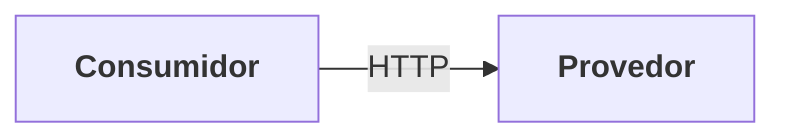
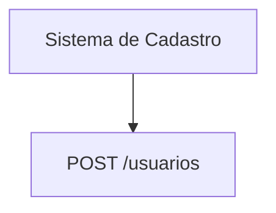
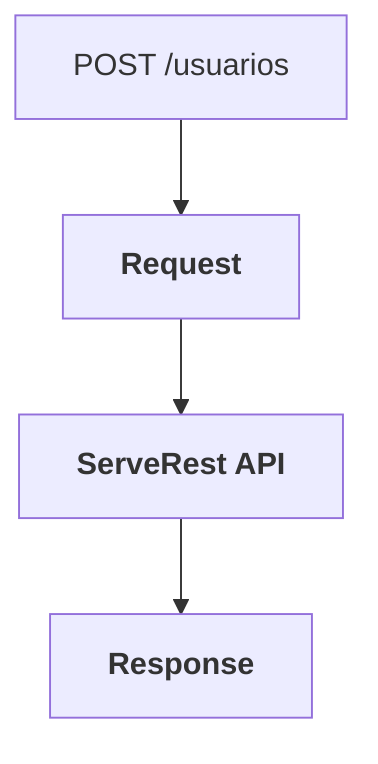
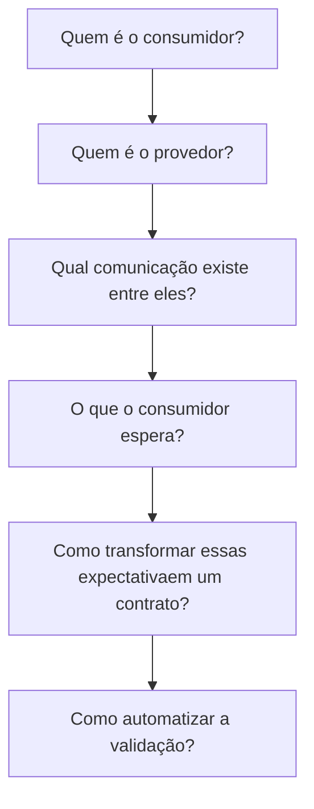
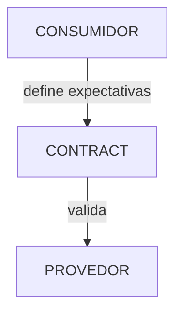
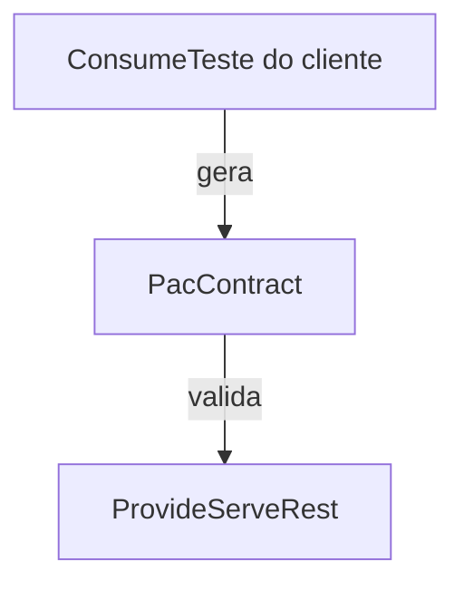
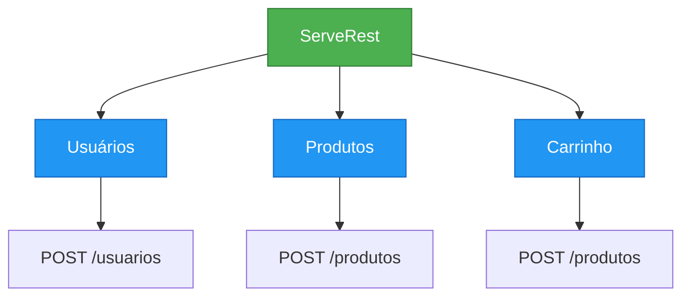

# Documento: Teste de Contrato — Criação de Usuário no ServeRest

## 1. Objetivo

O objetivo deste exercício é apresentar o conceito de Teste de Contrato utilizando a API ServeRest.

Neste primeiro cenário, vamos validar o contrato do endpoint responsável pela criação de usuários.

Ao final do exercício, o aluno deverá ser capaz de:

- Entender o que é um teste de contrato.
- Identificar um contrato entre consumidor e provedor.
- Definir as expectativas do consumidor.
- Validar o formato da requisição.
- Validar o formato da resposta.
- Validar status HTTP e campos obrigatórios.
- Identificar uma quebra de contrato.

## 2. O que é Teste de Contrato?

Imagine que temos dois sistemas:



O consumidor utiliza uma API fornecida por outro sistema.

Para que os dois sistemas consigam trabalhar juntos, é necessário existir um acordo sobre:

- Qual endpoint será utilizado.
- Qual método HTTP será utilizado.
- Quais dados serão enviados.
- Quais dados serão retornados.
- Quais códigos HTTP poderão ser recebidos.
- Qual será o formato da resposta.

Esse acordo é o contrato.

O Teste de Contrato verifica se esse acordo continua sendo respeitado.

> Importante: Teste de Contrato não tem como objetivo validar toda a regra de negócio da aplicação. O foco principal é verificar se consumidor e provedor continuam falando a mesma "língua".

## 3. Nosso cenário

Para o exercício, vamos considerar o seguinte cenário:

Um sistema consumidor precisa criar um novo usuário no ServeRest.

O consumidor fará uma requisição HTTP para a API.

> POST /usuarios

Enviando informações como:

```json
{
  "nome": "Fulano da Silva",
  "email": "fulano@example.com",
  "password": "123456",
  "administrador": "false"
}
```

A API deverá processar essa requisição e retornar uma resposta compatível com o contrato esperado.

## 4. Quem é o consumidor e quem é o provedor?

Essa distinção é muito importante para entender Teste de Contrato.

Consumidor

É quem utiliza a API.

No nosso exemplo, podemos imaginar:




Esse sistema possui expectativas sobre a API.

Por exemplo:

> "Quando eu enviar um usuário válido, espero receber uma resposta indicando que o usuário foi criado."

Provedor

É quem disponibiliza a API.

No nosso exercício:

> ServeRest

A responsabilidade do provedor é cumprir o contrato definido com o consumidor.

## 5. O contrato

Antes de escrever o teste, precisamos definir o que esperamos da API.

Para o nosso primeiro cenário:

Requisição

Método:

> POST


Endpoint:

> /usuarios


Content-Type:

> application/json

Body

```json
{
  "nome": "Fulano da Silva",
  "email": "fulano@example.com",
  "password": "123456",
  "administrador": "false"
}
```

O contrato pode ser representado conceitualmente assim:

> POST /usuarios

Request
│
├── nome          string
├── email         string
├── password      string
└── administrador string

## 6. O que devemos validar?

Um erro comum é pensar:

> "Se retornou HTTP 201, o teste de contrato passou."

Não necessariamente.

Precisamos validar a estrutura da comunicação.

Por exemplo:

Requisição

Devemos verificar:

- Método HTTP.
- Endpoint.
- Headers.
- Content-Type.
- Campos obrigatórios.
- Tipos dos campos.
- Resposta

Devemos verificar:

- Status HTTP.
- Content-Type.
- Estrutura do JSON.
- Campos esperados.
- Tipos dos campos.
- Formato dos valores.

## 7. Exemplo de contrato da resposta

Supondo que a API retorne algo semelhante a:

```json
{
  "message": "Cadastro realizado com sucesso",
  "_id": "64abc123456789"
}
```

O contrato pode estabelecer que a resposta deverá possuir:

```text
Response
│
├── message : string
└── _id     : string
```

E também podemos definir:

```bash
HTTP Status: 201
Content-Type: application/json
```

## 8. Primeiro cenário de teste

Vamos começar pelo cenário mais simples: `CT01 — Criar usuário com dados válidos`

Dado que o consumidor possui os dados de um novo usuário.

Quando realizar:

```bash
POST /usuarios
```

Então a API deverá:

- Retornar HTTP 201.
- Retornar Content-Type: application/json.
- Retornar um campo message.
- Retornar um campo _id.
- O campo _id deverá ser uma string.
- O campo message deverá ser uma string.

## 9. Representação do teste

Podemos visualizar o cenário desta forma:

CONTRATO



## 10. O que caracteriza uma quebra de contrato?

Imagine que o consumidor espera:

```json
{
  "message": "Cadastro realizado com sucesso",
  "_id": "64abc123"
}
```

Mas o provedor passa a retornar:

```json
{
  "mensagem": "Cadastro realizado com sucesso",
  "_id": "64abc123"
}
```

Perceba que:

> Esperado: message

> Recebido:  mensagem


Mesmo que a API continue funcionando internamente, existe uma quebra de contrato.

O consumidor que procura:

> response.body.message

poderá deixar de funcionar.

## 11. Outro exemplo de quebra

Contrato:

```json
{
  "_id": "64abc123"
}
```

O consumidor espera:

> _id → string


O provedor altera a resposta para:

```json
{
  "_id": 123456
}
```

Agora temos:

Esperado:
_id → string

Recebido:
_id → number


Isso também representa uma quebra de contrato.

## 12. Teste de contrato x teste funcional

Essa diferença é importante para os alunos.

Teste funcional

Pergunta:

> "A funcionalidade de criação de usuário funciona corretamente?"

Podemos verificar:

- usuário foi criado;
- usuário pode ser consultado;
- e-mail duplicado é rejeitado;
- regras de negócio são respeitadas.

## Teste de contrato

Pergunta:

> "A API continua respeitando o acordo que o consumidor espera?"

Podemos verificar:

- endpoint;
- método HTTP;
- request;
- response;
- status;
- estrutura;
- tipos;
- campos obrigatórios.

Podemos resumir:
|-------|---------------------------------------|
Tipo	Principal preocupação
Teste funcional	A funcionalidade funciona?
Teste de contrato	A comunicação respeita o contrato?
Teste de integração	Os componentes funcionam juntos?
Teste E2E	O fluxo completo funciona?


## 13. Onde o Teste de Contrato começa?

Essa é uma das principais perguntas que queremos responder com este exercício.

O teste começa antes da implementação do teste automatizado.

### Começamos identificando:



### Portanto:

Teste de Contrato começa na definição das expectativas do consumidor sobre a comunicação com o provedor.

## 14. Evoluindo para um contrato automatizado

Depois de entender o contrato manualmente, podemos automatizá-lo.

Uma abordagem bastante conhecida é utilizar Consumer-Driven Contract Testing.

Nesse modelo:



Uma ferramenta bastante utilizada para isso é o Pact.

A ideia é que o consumidor defina algo como:

Eu preciso que:

POST /usuarios

receba:

```json
{
    nome: string,
    email: string,
    password: string,
    administrador: string
}
```

e retorne:

HTTP 201
```json
{
    message: string,
    _id: string
}
```

O contrato pode então ser utilizado para validar o provedor.

## 15. Estrutura conceitual com Pact

Em uma arquitetura utilizando Pact:




O objetivo é garantir que uma alteração no provedor não quebre silenciosamente o consumidor.

## 16. Exercício para os alunos

### Parte 1 — Identificação

Responder:

1. Quem é o consumidor?
2. Quem é o provedor?
3. Qual é o endpoint utilizado?
4. Qual é o método HTTP?
5. Qual é o Content-Type?
6. Quais campos são enviados?
7. Quais são os tipos desses campos?
8. Qual status HTTP esperamos?
9. Quais campos esperamos na resposta?
10. Quais são os tipos desses campos?

### Parte 2 — Definição do contrato

Os alunos deverão criar uma tabela semelhante a esta:

| Item              | Expectativa           |
|-------------------|-----------------------|
| Método            | POST                  |
| Endpoint          | /usuarios             |
| Content-Type      | application/json      |
| nome              | string                |
| email             | string                |
| password          | string                |
| administrador     | string                |
| Status esperado   | 201                   |
| message           | string                |
| _id               | string                |


### Parte 3 — Automatização

Depois de definir o contrato, o aluno deverá automatizar a validação.

O teste deverá verificar pelo menos:

- Método HTTP
- Endpoint
- Request
- Status HTTP
- Content-Type
- Campos da resposta
- Tipos dos campos

## 17. Pergunta para discussão em sala

Uma boa discussão para finalizar essa primeira etapa é:

> Se a API continuar retornando HTTP 201, mas alterar o nome de um campo da resposta, temos uma quebra de contrato?

Resposta esperada: `Sim`.

O status HTTP sozinho não representa todo o contrato.

Por exemplo:

// Contrato

```json
{
    "message": "Cadastro realizado com sucesso"
}
```

Alteração:

```json
{
    "mensagem": "Cadastro realizado com sucesso"
}
```

A API pode continuar respondendo 201, mas o consumidor que espera message poderá quebrar.

## 18. Próximos passos

Depois da criação de usuário, podemos evoluir o exercício para outros contratos:




Uma sequência interessante para as aulas seria:

1. Criar usuário
2. Consultar usuário
3. Atualizar usuário
4. Excluir usuário
5. Criar produto
6. Consultar produto
7. Fluxo de autenticação
8. Identificação de quebra de contrato
9. Consumer-Driven Contract
10. Automatização com Pact

## Conclusão

A evolução do aprendizado pode seguir três etapas principais:

1. Entender o contrato
2. Validar o contrato
3. Automatizar o contrato

O aluno primeiro entende o que é o contrato, depois aprende como validá-lo e finalmente chega à automação com uma ferramenta especializada.

O objetivo final é garantir que mudanças em um provedor sejam detectadas antes de causarem problemas inesperados nos consumidores.