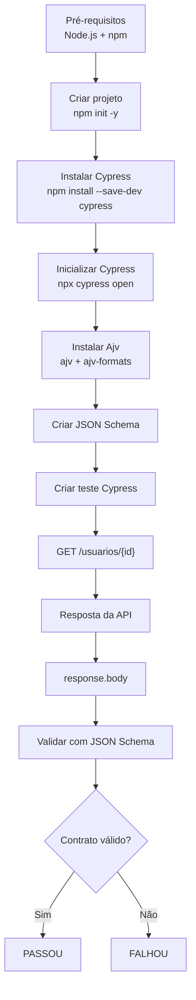
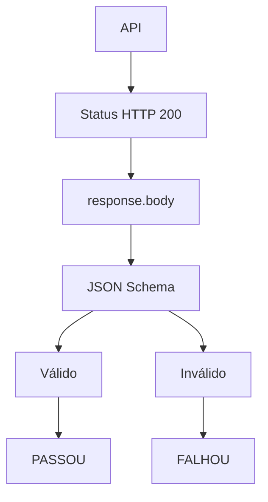

# Teste de Contrato com Cypress e JSON Schema

## 1. O que vamos testar?

Um **teste de contrato** tem como objetivo garantir que a API continua respeitando o formato esperado pelo consumidor.

Neste exemplo, faremos uma requisição `GET` para buscar um usuário:

```bash
GET https://serverest.dev/usuarios/0uxuPY0cbmQhpEz1
```

A API deve retornar uma estrutura semelhante a:

```json
{
  "nome": "Fulano da Silva",
  "email": "fulano@qa.com",
  "password": "teste",
  "administrador": "true",
  "_id": "0uxuPY0cbmQhpEz1"
}
```

O **JSON Schema** será responsável por definir o contrato:

> "Eu espero que a resposta tenha essa estrutura e que cada campo tenha determinado tipo."

---

# 2. Pré-requisitos

Antes de começar, precisamos ter o **Node.js** instalado.

Podemos verificar a instalação utilizando:

```bash
node --version
npm --version
```

Caso ainda não esteja instalado, faça o download pelo site oficial:

https://nodejs.org/pt-br

---

# 3. Criar o projeto

Primeiro, vamos criar uma pasta para o projeto:

```bash
mkdir teste-contrato-cypress
cd teste-contrato-cypress
```

Depois, inicializamos um projeto Node.js:

```bash
npm init -y
```

Esse comando cria o arquivo:

```text
package.json
```

O `package.json` será responsável por armazenar as informações do projeto e suas dependências.

---

# 4. Instalar o Cypress

Com o projeto Node.js criado, instalamos o Cypress como dependência de desenvolvimento:

```bash
npm install --save-dev cypress
```

Depois, podemos verificar a instalação:

```bash
npx cypress --version
```

---

# 5. Inicializar o Cypress

Agora vamos abrir o Cypress:

```bash
npx cypress open
```

Na primeira execução, o Cypress apresentará algumas opções de configuração.

Para este projeto, escolha:

```text
E2E Testing
```

Depois escolha o navegador de sua preferência.

O Cypress criará os arquivos básicos de configuração do projeto.

---

# 6. Estrutura inicial do projeto

Depois da configuração, teremos uma estrutura semelhante a:

```text
teste-contrato-cypress/

├── cypress/
│   ├── e2e/
│   ├── fixtures/
│   └── support/
│
├── node_modules/
├── cypress.config.js
├── package.json
└── package-lock.json
```

Para executar os testes pelo terminal:

```bash
npx cypress run
```

Para abrir a interface do Cypress:

```bash
npx cypress open
```

---

# 7. Instalar o JSON Schema Validator

Agora que o Cypress está configurado, precisamos de uma biblioteca para validar a resposta da API contra o JSON Schema.

Neste projeto utilizaremos o **Ajv**.

Instalamos o Ajv e o suporte a formatos:

```bash
npm install --save-dev ajv ajv-formats
```

O `ajv` será responsável pela validação do JSON Schema.

O `ajv-formats` permite validar formatos específicos, como:

```text
email
date
uri
uuid
```

Neste exemplo, utilizaremos o formato `email`.

---

# 8. Organizar a estrutura do projeto

Agora podemos organizar os arquivos do teste de contrato:

```text
teste-contrato-cypress/

├── cypress/
│   ├── e2e/
│   │   └── contrato/
│   │       └── usuario.cy.js
│   │
│   ├── fixtures/
│   │   └── schemas/
│   │       └── usuario.schema.json
│   │
│   └── support/
│       └── e2e.js
│
├── node_modules/
├── cypress.config.js
├── package.json
└── package-lock.json
```

A separação possui uma responsabilidade clara:

* `usuario.schema.json` → define o contrato esperado.
* `usuario.cy.js` → executa a requisição e valida o contrato.
* `fixtures/schemas` → armazena os schemas para facilitar sua reutilização.
* `e2e/contrato` → concentra os testes de contrato.

---

# 9. Criar o JSON Schema

Agora vamos transformar a resposta esperada da API em um contrato.

Crie o arquivo:

```text
cypress/fixtures/schemas/usuario.schema.json
```

Conteúdo:

```json
{
  "$schema": "https://json-schema.org/draft/2020-12/schema",
  "title": "Usuário",
  "type": "object",
  "required": [
    "nome",
    "email",
    "password",
    "administrador",
    "_id"
  ],
  "properties": {
    "nome": {
      "type": "string"
    },
    "email": {
      "type": "string",
      "format": "email"
    },
    "password": {
      "type": "string"
    },
    "administrador": {
      "type": "string"
    },
    "_id": {
      "type": "string"
    }
  },
  "additionalProperties": false
}
```

## Observação sobre `administrador`

Na resposta da API temos:

```json
"administrador": "true"
```

O valor está entre aspas, portanto é uma **string**.

Por isso, o schema utiliza:

```json
"administrador": {
  "type": "string"
}
```

Se a API retornasse:

```json
"administrador": true
```

então o tipo correto seria:

```json
"administrador": {
  "type": "boolean"
}
```

---

# 10. O que o JSON Schema está definindo?

O schema estabelece algumas regras para a resposta.

| Campo                  | Regra                                         |
| ---------------------- | --------------------------------------------- |
| `nome`                 | Deve ser `string`                             |
| `email`                | Deve ser `string` e possuir formato de e-mail |
| `password`             | Deve ser `string`                             |
| `administrador`        | Deve ser `string`                             |
| `_id`                  | Deve ser `string`                             |
| `required`             | Todos os campos devem existir                 |
| `additionalProperties` | Não permite campos adicionais                 |

Por exemplo, esta resposta é válida:

```json
{
  "nome": "Fulano da Silva",
  "email": "fulano@qa.com",
  "password": "teste",
  "administrador": "true",
  "_id": "0uxuPY0cbmQhpEz1"
}
```

Mas esta resposta será inválida:

```json
{
  "nome": 123,
  "email": "fulano@qa.com",
  "password": "teste",
  "administrador": "true",
  "_id": "0uxuPY0cbmQhpEz1"
}
```

Isso acontece porque:

```text
nome
 ↓
esperado: string
recebido: number
```

---

# 11. Criar o teste de contrato

Agora vamos implementar o teste.

Crie:

```text
cypress/e2e/contrato/usuario.cy.js
```

Como estamos utilizando o **Draft 2020-12**, vamos utilizar o `Ajv2020`:

```javascript
import Ajv2020 from 'ajv/dist/2020'
import addFormats from 'ajv-formats'

describe('Teste de contrato - Usuário', () => {
  const ajv = new Ajv2020()

  addFormats(ajv)

  it('deve validar o contrato da API de usuário', () => {
    cy.fixture('schemas/usuario.schema.json').then((schema) => {
      cy.request({
        method: 'GET',
        url: 'https://serverest.dev/usuarios/0uxuPY0cbmQhpEz1'
      }).then((response) => {
        expect(response.status).to.eq(200)

        const validate = ajv.compile(schema)

        const valid = validate(response.body)

        expect(
          valid,
          `Contrato inválido: ${JSON.stringify(validate.errors, null, 2)}`
        ).to.be.true
      })
    })
  })
})
```

---

# 12. Entendendo o teste

O teste possui algumas etapas importantes.

### 12.1 Carregar o schema

```javascript
cy.fixture('schemas/usuario.schema.json')
```

Aqui carregamos o JSON Schema que representa nosso contrato.

---

### 12.2 Fazer a requisição

```javascript
cy.request({
  method: 'GET',
  url: 'https://serverest.dev/usuarios/0uxuPY0cbmQhpEz1'
})
```

O Cypress realiza uma requisição `GET` para a API.

---

### 12.3 Validar o status HTTP

```javascript
expect(response.status).to.eq(200)
```

Primeiro verificamos se a API respondeu com HTTP `200`.

---

### 12.4 Compilar o schema

```javascript
const validate = ajv.compile(schema)
```

O Ajv transforma o JSON Schema em uma função de validação.

---

### 12.5 Validar a resposta

```javascript
const valid = validate(response.body)
```

Aqui acontece a validação principal:

```text
response.body
      ↓
    Ajv
      ↓
JSON Schema
      ↓
válido / inválido
```

---

### 12.6 Garantir que o contrato foi respeitado

```javascript
expect(valid).to.be.true
```

Se a resposta respeitar o contrato:

```text
valid = true
```

O teste passa.

Se alguma regra do schema for violada:

```text
valid = false
```

O teste falha.

---

# 13. Fluxo completo do teste

Podemos representar o processo desta forma:



---

# 14. Executar o teste

Com tudo configurado, podemos executar os testes pelo terminal:

```bash
npx cypress run
```

Ou abrir a interface gráfica:

```bash
npx cypress open
```

---

# 15. O que estamos garantindo?

É importante entender que este teste não verifica somente:

```text
HTTP 200
```

Estamos verificando duas coisas:



Portanto, o objetivo do **teste de contrato** é garantir que a API continue entregando uma resposta compatível com o contrato esperado pelo consumidor.

Se amanhã alguém alterar a API e modificar:

```json
"nome": "Fulano da Silva"
```

para:

```json
"nome": 123
```

o teste identificará a quebra do contrato.

Da mesma forma, o teste poderá detectar:

* campos obrigatórios ausentes;
* tipos incorretos;
* formato de e-mail inválido;
* campos adicionais não previstos;
* alterações inesperadas na estrutura da resposta.

Dessa forma, o JSON Schema funciona como uma **regra formal do contrato da API**, enquanto o Cypress é responsável por executar a chamada e verificar se a API continua respeitando esse contrato.
