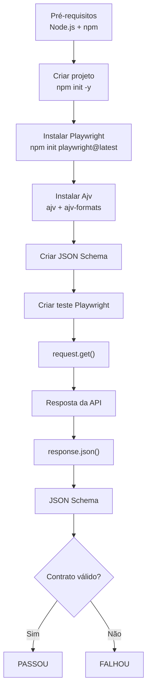
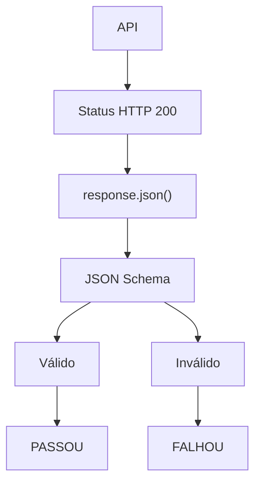
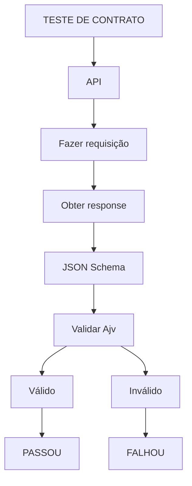

# Teste de Contrato com Playwright e JSON Schema

## 1. O que vamos testar?

Um **teste de contrato** tem como objetivo garantir que a API continua respeitando o formato esperado pelo consumidor.

Neste exemplo, faremos uma requisição `GET` para buscar um usuário:

```bash
GET https://serverest.dev/usuarios/0uxuPY0cbmQhpEz1
```

A API deve retornar uma estrutura semelhante a:

```json
{
  "nome": "Fulano da Silva",
  "email": "fulano@qa.com",
  "password": "teste",
  "administrador": "true",
  "_id": "0uxuPY0cbmQhpEz1"
}
```

O **JSON Schema** será responsável por definir o contrato:

> "Eu espero que a resposta tenha essa estrutura e que cada campo tenha determinado tipo."

---

# 2. Pré-requisitos

Precisamos ter o **Node.js** instalado.

Verifique as versões:

```bash
node --version
npm --version
```

Caso ainda não tenha o Node.js instalado, faça o download pelo site oficial:

https://nodejs.org/pt-br

---

# 3. Criar o projeto

Crie uma pasta para o projeto:

```bash
mkdir teste-contrato-playwright
cd teste-contrato-playwright
```

Inicialize o projeto Node.js:

```bash
npm init -y
```

Esse comando criará o arquivo:

```text
package.json
```

---

# 4. Instalar o Playwright

Agora instalamos o Playwright Test:

```bash
npm init playwright@latest
```

Durante a instalação, serão apresentadas algumas perguntas.

Para um projeto de teste de contrato, podemos utilizar uma configuração semelhante a:

```text
Do you want to use TypeScript or JavaScript?
JavaScript

Where to put your end-to-end tests?
tests

Add a GitHub Actions workflow?
No

Install Playwright browsers?
Yes
```

Como nosso objetivo é testar uma API, os navegadores não são necessários para a execução do teste de contrato, mas podem ser instalados caso o mesmo projeto também tenha testes E2E.

---

# 5. Estrutura inicial do projeto

Após a inicialização, teremos uma estrutura semelhante a:

```text
teste-contrato-playwright/

├── tests/
├── node_modules/
├── package.json
├── package-lock.json
└── playwright.config.js
```

Dependendo das opções escolhidas durante a instalação, alguns arquivos adicionais podem ser criados.

---

# 6. Instalar o Ajv

Agora precisamos de uma biblioteca para validar o JSON Schema.

Vamos utilizar o **Ajv**:

```bash
npm install --save-dev ajv ajv-formats
```

O `ajv` será responsável por validar o JSON Schema.

O `ajv-formats` permite validar formatos como:

```text
email
date
uri
uuid
```

Neste exemplo, utilizaremos o formato `email`.

---

# 7. Organizar o projeto

Vamos organizar os arquivos para separar o contrato do teste:

```text
teste-contrato-playwright/

├── tests/
│   └── contrato/
│       └── usuario.spec.js
│
├── schemas/
│   └── usuario.schema.json
│
├── node_modules/
├── package.json
├── package-lock.json
└── playwright.config.js
```

A responsabilidade de cada arquivo será:

* `usuario.schema.json` → define o contrato esperado.
* `usuario.spec.js` → executa a requisição e valida o contrato.
* `schemas/` → centraliza os contratos JSON Schema.

---

# 8. Criar o JSON Schema

Crie o arquivo:

```text
schemas/usuario.schema.json
```

Utilizaremos o **Draft 2020-12**:

```json
{
  "$schema": "https://json-schema.org/draft/2020-12/schema",
  "title": "Usuário",
  "type": "object",
  "required": [
    "nome",
    "email",
    "password",
    "administrador",
    "_id"
  ],
  "properties": {
    "nome": {
      "type": "string"
    },
    "email": {
      "type": "string",
      "format": "email"
    },
    "password": {
      "type": "string"
    },
    "administrador": {
      "type": "string"
    },
    "_id": {
      "type": "string"
    }
  },
  "additionalProperties": false
}
```

## Observação sobre `administrador`

A API retorna:

```json
"administrador": "true"
```

Como `"true"` está entre aspas, seu tipo é `string`.

Por isso utilizamos:

```json
"administrador": {
  "type": "string"
}
```

Se a API retornasse:

```json
"administrador": true
```

o schema deveria utilizar:

```json
"administrador": {
  "type": "boolean"
}
```

---

# 9. Criar o teste de contrato

Agora vamos criar:

```text
tests/contrato/usuario.spec.js
```

O Playwright possui uma API própria para realizar requisições HTTP.

Utilizaremos o `request` fornecido pelo Playwright:

```javascript
import { test, expect } from '@playwright/test'
import Ajv2020 from 'ajv/dist/2020'
import addFormats from 'ajv-formats'
import fs from 'fs'

test.describe('Teste de contrato - Usuário', () => {

  const ajv = new Ajv2020()

  addFormats(ajv)

  test('deve validar o contrato da API de usuário', async ({ request }) => {

    const schema = JSON.parse(
      fs.readFileSync('schemas/usuario.schema.json', 'utf-8')
    )

    const response = await request.get(
      'https://serverest.dev/usuarios/0uxuPY0cbmQhpEz1'
    )

    expect(response.status()).toBe(200)

    const responseBody = await response.json()

    const validate = ajv.compile(schema)

    const valid = validate(responseBody)

    expect(
      valid,
      `Contrato inválido: ${JSON.stringify(validate.errors, null, 2)}`
    ).toBe(true)
  })
})
```

---

# 10. Entendendo o teste

O teste possui algumas etapas.

## 10.1 Importar o Playwright

```javascript
import { test, expect } from '@playwright/test'
```

O `test` permite criar os testes.

O `expect` permite realizar as asserções.

---

## 10.2 Importar o Ajv

```javascript
import Ajv2020 from 'ajv/dist/2020'
import addFormats from 'ajv-formats'
```

Como nosso schema utiliza o Draft 2020-12, utilizamos:

```javascript
Ajv2020
```

Isso evita o erro de incompatibilidade entre o schema e a versão do Ajv.

---

## 10.3 Carregar o JSON Schema

```javascript
const schema = JSON.parse(
  fs.readFileSync('schemas/usuario.schema.json', 'utf-8')
)
```

Aqui lemos o arquivo:

```text
schemas/usuario.schema.json
```

e transformamos o conteúdo JSON em um objeto JavaScript.

---

# 11. Fazer a requisição

O Playwright fornece o objeto `request`:

```javascript
test('...', async ({ request }) => {
```

Podemos então executar:

```javascript
const response = await request.get(
  'https://serverest.dev/usuarios/0uxuPY0cbmQhpEz1'
)
```

O fluxo é:

```text
Playwright
    │
    ▼
request.get()
    │
    ▼
API
    │
    ▼
HTTP Response
```

---

# 12. Validar o status HTTP

Primeiro verificamos se a API respondeu corretamente:

```javascript
expect(response.status()).toBe(200)
```

Isso garante:

```text
HTTP 200
```

Porém, somente isso não caracteriza um teste de contrato completo.

A API poderia retornar `200` com uma estrutura completamente diferente.

Por isso precisamos validar o corpo da resposta.

---

# 13. Obter o response.body

O Playwright permite converter a resposta para JSON:

```javascript
const responseBody = await response.json()
```

Agora temos:

```text
response
   │
   ▼
response.json()
   │
   ▼
responseBody
```

---

# 14. Compilar o JSON Schema

Agora utilizamos o Ajv:

```javascript
const validate = ajv.compile(schema)
```

O Ajv transforma o schema em uma função de validação.

---

# 15. Validar a resposta

Finalmente:

```javascript
const valid = validate(responseBody)
```

Estamos comparando:

```text
responseBody
      │
      ▼
    Ajv
      │
      ▼
JSON Schema
```

O resultado será:

```text
true
```

ou:

```text
false
```

---

# 16. Validar o resultado

Utilizamos:

```javascript
expect(
  valid,
  `Contrato inválido: ${JSON.stringify(validate.errors, null, 2)}`
).toBe(true)
```

Se o contrato estiver correto:

```text
valid = true
     ↓
PASSOU
```

Se houver alguma violação:

```text
valid = false
     ↓
FALHOU
```

Além disso, o `validate.errors` apresenta detalhes sobre o motivo da falha.

---

# 17. Exemplo de contrato inválido

Imagine que a API passe a retornar:

```json
{
  "nome": 123,
  "email": "fulano@qa.com",
  "password": "teste",
  "administrador": "true",
  "_id": "0uxuPY0cbmQhpEz1"
}
```

O schema espera:

```text
nome → string
```

Mas a API retornou:

```text
nome → number
```

O Ajv identificará essa diferença e:

```text
Contrato inválido
       ↓
valid = false
       ↓
expect(false).toBe(true)
       ↓
TESTE FALHOU
```

---

# 18. Fluxo completo

O processo pode ser representado da seguinte maneira:



---

# 19. Fluxo de validação

De forma mais específica, podemos visualizar somente a validação:



---

# 20. Executar o teste

Para executar todos os testes:

```bash
npx playwright test
```

Para executar especificamente o teste de contrato:

```bash
npx playwright test tests/contrato/usuario.spec.js
```

Para executar com interface visual:

```bash
npx playwright test --ui
```

Para visualizar o relatório:

```bash
npx playwright show-report
```

---

# 21. Comparando Cypress e Playwright

O conceito do teste permanece praticamente o mesmo:



---

# 22. Resultado esperado

Ao executar:

```bash
npx playwright test
```

esperamos algo semelhante a:

```text
Running 3 tests using 3 workers
  3 passed (5.2s)

To open last HTML report run:

  npx playwright show-report
```

Dessa forma, temos um teste automatizado que verifica não apenas se a API está disponível, mas se sua resposta continua obedecendo ao **contrato definido pelo JSON Schema**.
