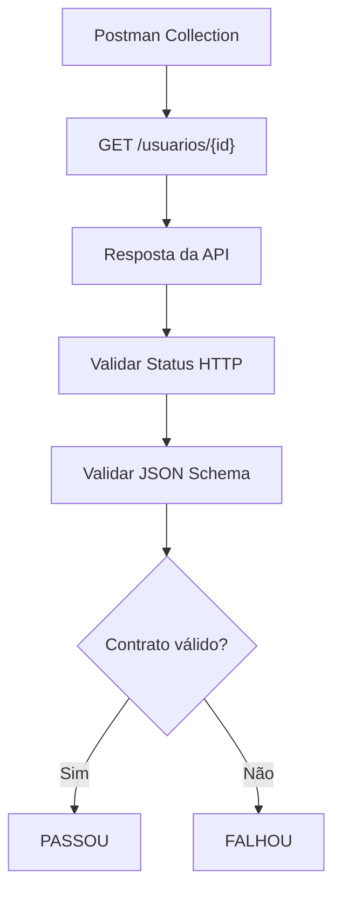
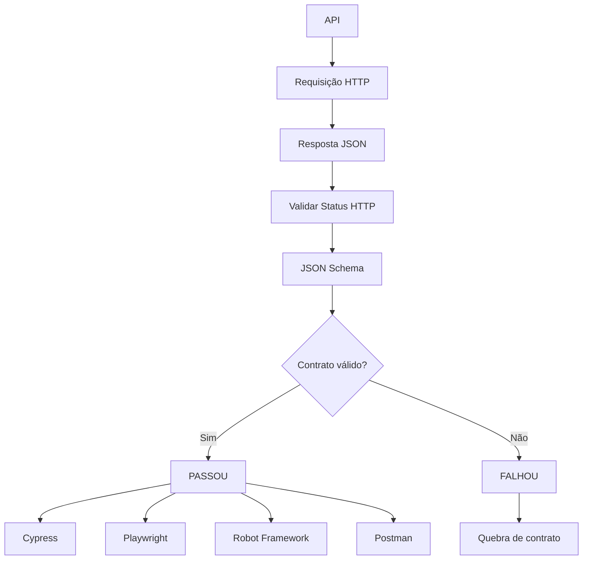

# Teste de Contrato com Postman e JSON Schema

## 1. O que vamos testar?

```bash
GET https://serverest.dev/usuarios/0uxuPY0cbmQhpEz1
```

Esperamos uma resposta semelhante a:

```json
{
  "nome": "Fulano da Silva",
  "email": "fulano@qa.com",
  "password": "teste",
  "administrador": "true",
  "_id": "0uxuPY0cbmQhpEz1"
}
```

O objetivo é validar:

* Status HTTP `200`;
* estrutura da resposta;
* campos obrigatórios;
* tipos dos campos;
* formato do e-mail;
* ausência de propriedades adicionais.

---

# 2. Estrutura da Collection

A Collection terá uma requisição:

```text
Teste de Contrato - Usuário
└── GET - Buscar usuário
```

E o fluxo será:



---

# 3. JSON Schema

O schema utilizado será:

```json
{
  "$schema": "https://json-schema.org/draft/2020-12/schema",
  "title": "Usuário",
  "type": "object",
  "required": [
    "nome",
    "email",
    "password",
    "administrador",
    "_id"
  ],
  "properties": {
    "nome": {
      "type": "string"
    },
    "email": {
      "type": "string",
      "format": "email"
    },
    "password": {
      "type": "string"
    },
    "administrador": {
      "type": "string"
    },
    "_id": {
      "type": "string"
    }
  },
  "additionalProperties": false
}
```

---

# 4. Criar a Collection

No Postman:

```text
Collections
    ↓
New Collection
    ↓
Teste de Contrato - ServeRest
```

Dentro da Collection, crie uma requisição:

```text
GET - Buscar usuário
```

Configure:

```text
Method:
GET

URL:
https://serverest.dev/usuarios/0uxuPY0cbmQhpEz1
```

---

# 5. Teste de Status HTTP

Na aba **Scripts → Post-response**, podemos começar validando o status:

```javascript
pm.test("Status HTTP deve ser 200", function () {
    pm.response.to.have.status(200);
});
```

Esse é o primeiro nível da validação.

---

# 6. Validar o JSON Schema

O Postman possui suporte a validação utilizando JSON Schema através do `pm.response.to.have.jsonSchema()`.

No script **Post-response**, podemos colocar:

```javascript
const schema = {
    "$schema": "https://json-schema.org/draft/2020-12/schema",
    "title": "Usuário",
    "type": "object",
    "required": [
        "nome",
        "email",
        "password",
        "administrador",
        "_id"
    ],
    "properties": {
        "nome": {
            "type": "string"
        },
        "email": {
            "type": "string",
            "format": "email"
        },
        "password": {
            "type": "string"
        },
        "administrador": {
            "type": "string"
        },
        "_id": {
            "type": "string"
        }
    },
    "additionalProperties": false
};

pm.test("Contrato da API deve ser válido", function () {
    pm.response.to.have.jsonSchema(schema);
});
```

---

# 7. Validar campos específicos

Além da validação do JSON Schema, podemos criar algumas asserções específicas:

```javascript
pm.test("Nome deve existir", function () {
    pm.expect(pm.response.json()).to.have.property("nome");
});

pm.test("Email deve existir", function () {
    pm.expect(pm.response.json()).to.have.property("email");
});

pm.test("ID deve existir", function () {
    pm.expect(pm.response.json()).to.have.property("_id");
});
```

Entretanto, essas validações são complementares.

O principal teste de contrato continua sendo:

```javascript
pm.response.to.have.jsonSchema(schema);
```

---

# 8. Script completo

O script **Post-response** pode ficar assim:

```javascript
const schema = {
    "$schema": "https://json-schema.org/draft/2020-12/schema",
    "title": "Usuário",
    "type": "object",
    "required": [
        "nome",
        "email",
        "password",
        "administrador",
        "_id"
    ],
    "properties": {
        "nome": {
            "type": "string"
        },
        "email": {
            "type": "string",
            "format": "email"
        },
        "password": {
            "type": "string"
        },
        "administrador": {
            "type": "string"
        },
        "_id": {
            "type": "string"
        }
    },
    "additionalProperties": false
};

pm.test("Status HTTP deve ser 200", function () {
    pm.response.to.have.status(200);
});

pm.test("Contrato da API deve ser válido", function () {
    pm.response.to.have.jsonSchema(schema);
});

pm.test("Nome deve existir", function () {
    pm.expect(pm.response.json()).to.have.property("nome");
});

pm.test("Email deve existir", function () {
    pm.expect(pm.response.json()).to.have.property("email");
});

pm.test("ID deve existir", function () {
    pm.expect(pm.response.json()).to.have.property("_id");
});
```

---

# 9. Resultado esperado

Quando a API respeitar o contrato:

```text
✓ Status HTTP deve ser 200
✓ Contrato da API deve ser válido
✓ Nome deve existir
✓ Email deve existir
✓ ID deve existir
```

Resultado:

```text
5 passed
```

Se, por exemplo, a API retornar:

```json
{
    "nome": 123,
    "email": "fulano@qa.com",
    "password": "teste",
    "administrador": "true",
    "_id": "0uxuPY0cbmQhpEz1"
}
```

o teste de contrato deverá falhar porque:

```text
nome
 ↓
Esperado: string
Recebido: number
```

---

# 10. Collection completa

A Collection pode ser salva como:

```text
postman/collections/teste-contrato-usuario.postman_collection.json
```

Um exemplo de arquivo de Collection é:

```json
{
  "info": {
    "_postman_id": "7f1b4c9a-3f12-4d4e-9a71-usuario-contrato",
    "name": "Teste de Contrato - ServeRest",
    "description": "Testes de contrato da API de usuários utilizando JSON Schema.",
    "schema": "https://schema.getpostman.com/json/collection/v2.1.0/collection.json"
  },
  "item": [
    {
      "name": "GET - Buscar usuário",
      "request": {
        "method": "GET",
        "header": [],
        "url": {
          "raw": "https://serverest.dev/usuarios/0uxuPY0cbmQhpEz1",
          "protocol": "https",
          "host": [
            "serverest",
            "dev"
          ],
          "path": [
            "usuarios",
            "0uxuPY0cbmQhpEz1"
          ]
        }
      },
      "event": [
        {
          "listen": "test",
          "script": {
            "type": "text/javascript",
            "exec": [
              "const schema = {",
              "    \"title\": \"Usuário\",",
              "    \"type\": \"object\",",
              "    \"required\": [",
              "        \"nome\",",
              "        \"email\",",
              "        \"password\",",
              "        \"administrador\",",
              "        \"_id\"",
              "    ],",
              "    \"properties\": {",
              "        \"nome\": {",
              "            \"type\": \"string\"",
              "        },",
              "        \"email\": {",
              "            \"type\": \"string\",",
              "            \"format\": \"email\"",
              "        },",
              "        \"password\": {",
              "            \"type\": \"string\"",
              "        },",
              "        \"administrador\": {",
              "            \"type\": \"string\"",
              "        },",
              "        \"_id\": {",
              "            \"type\": \"string\"",
              "        }",
              "    },",
              "    \"additionalProperties\": false",
              "};",
              "",
              "pm.test(\"Status HTTP deve ser 200\", function () {",
              "    pm.response.to.have.status(200);",
              "});",
              "",
              "pm.test(\"Contrato da API deve ser válido\", function () {",
              "    pm.response.to.have.jsonSchema(schema);",
              "});",
              "",
              "pm.test(\"Nome deve existir\", function () {",
              "    pm.expect(pm.response.json()).to.have.property(\"nome\");",
              "});",
              "",
              "pm.test(\"Email deve existir\", function () {",
              "    pm.expect(pm.response.json()).to.have.property(\"email\");",
              "});",
              "",
              "pm.test(\"ID deve existir\", function () {",
              "    pm.expect(pm.response.json()).to.have.property(\"_id\");",
              "});"
            ]
          }
        }
      ]
    }
  ]
}
```

---

# 11. Executar pela interface do Postman

Depois de importar a Collection:

```text
Collections
    ↓
Teste de Contrato - ServeRest
    ↓
GET - Buscar usuário
    ↓
Send
```

O Postman exibirá os testes na área de resultados.

---

# 12. Executar pelo Newman

Para executar a mesma Collection no terminal ou em um pipeline CI/CD, podemos utilizar o **Newman**, que é o executor de Collections do Postman.

Instalação:

```bash
npm install -g newman
```

Execução:

```bash
newman run collections/teste-contrato-usuario.postman_collection.json
```

Resultado esperado:

```text
┌─────────────────────────────┬────────┬─────────┐
│                             │ passed │ failed  │
├─────────────────────────────┼────────┼─────────┤
│ Status HTTP deve ser 200    │   ✓    │         │
│ Contrato da API deve ser... │   ✓    │         │
│ Nome deve existir           │   ✓    │         │
│ Email deve existir          │   ✓    │         │
│ ID deve existir             │   ✓    │         │
└─────────────────────────────┴────────┴─────────┘
```

---

# 13. Comparação entre as quatro ferramentas

Agora temos a mesma estratégia implementada em quatro ferramentas:

| Ferramenta      | Requisição              | Validação                          |
| --------------- | ----------------------- | ---------------------------------- |
| Cypress         | `cy.request()`          | Ajv + JSON Schema                  |
| Playwright      | `request.get()`         | Ajv + JSON Schema                  |
| Robot Framework | `GET` / RequestsLibrary | JSONSchemaLibrary                  |
| Postman         | `GET`                   | `pm.response.to.have.jsonSchema()` |

O conceito permanece exatamente o mesmo:



O ponto mais importante é que **o contrato deve ser o mesmo**, independentemente da ferramenta utilizada.

Idealmente, podemos ter um único:

```text
usuario.schema.json
```

e utilizá-lo como fonte de verdade nos testes de:

```text
Cypress
Playwright
Robot Framework
Postman
```

Isso evita que cada ferramenta tenha uma definição diferente do contrato da API.
::
