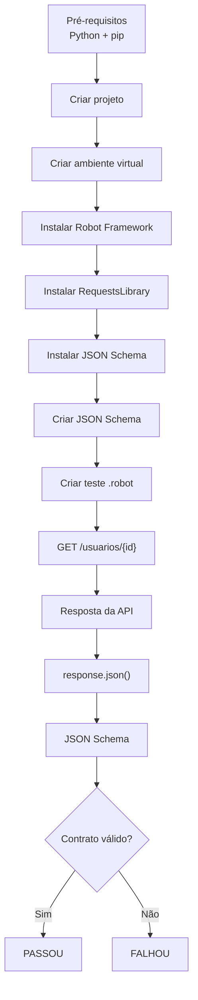
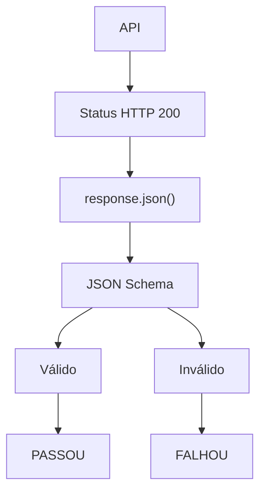
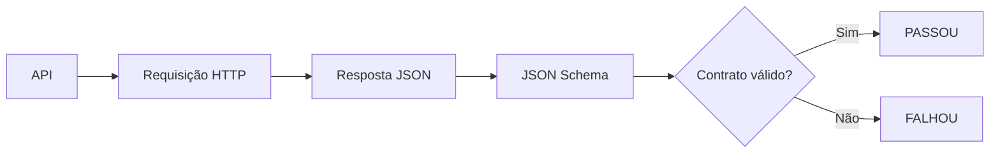

# Teste de Contrato com Robot Framework e JSON Schema

## 1. O que vamos testar?

Um **teste de contrato** tem como objetivo garantir que a API continua respeitando o formato esperado pelo consumidor.

Neste exemplo, faremos uma requisição `GET` para buscar um usuário:

```bash
GET https://serverest.dev/usuarios/0uxuPY0cbmQhpEz1
```

A API deve retornar uma estrutura semelhante a:

```json
{
  "nome": "Fulano da Silva",
  "email": "fulano@qa.com",
  "password": "teste",
  "administrador": "true",
  "_id": "0uxuPY0cbmQhpEz1"
}
```

O **JSON Schema** será responsável por definir o contrato:

> "Eu espero que a resposta tenha essa estrutura e que cada campo tenha determinado tipo."

---

# 2. Pré-requisitos

O Robot Framework é baseado em Python.

Primeiro, verifique se o Python está instalado:

```bash
python --version
```

ou:

```bash
python3 --version
```

Também podemos verificar o `pip`:

```bash
pip --version
```

ou:

```bash
pip3 --version
```

---

# 3. Criar o projeto

Crie uma pasta para o projeto:

```bash
mkdir teste-contrato-robot
cd teste-contrato-robot
```

É recomendado criar um ambiente virtual Python:

```bash
python -m venv .venv
```

No Linux/macOS:

```bash
source .venv/bin/activate
```

No Windows:

```bash
.venv\Scripts\activate
```

Depois disso, o terminal deverá indicar que o ambiente virtual está ativo.

---

# 4. Instalar o Robot Framework

Instale o Robot Framework:

```bash
pip install robotframework
```

Verifique a instalação:

```bash
robot --version
```

---

# 5. Instalar a biblioteca para requisições HTTP

Para realizar a chamada da API, utilizaremos a biblioteca **RequestsLibrary**.

Instale:

```bash
pip install robotframework-requests
```

Essa biblioteca permite realizar requisições HTTP diretamente nos testes Robot Framework.

---

# 6. Instalar o JSON Schema

Para validar a resposta da API utilizando JSON Schema, instalaremos a biblioteca `jsonschema`:

```bash
pip install jsonschema
```

Verifique se tudo está instalado:

```bash
pip list | grep -E "jsonschema|robotframework|robotframework-requests"
fastjsonschema                  2.20.0
jsonschema                      4.23.0
jsonschema-specifications       2024.10.1
robotframework                  7.1.1
robotframework-assertion-engine 3.0.3
robotframework-browser          18.9.1
robotframework-csvlibrary       0.0.5
robotframework-databaselibrary  2.4.1
robotframework-faker            5.0.0
robotframework-jsonlibrary      0.5
robotframework-pythonlibcore    4.4.1
robotframework-requests         0.9.7
robotframework-seleniumlibrary  6.6.1
```

Devemos encontrar, entre outras dependências:

```text
robotframework
robotframework-requests
jsonschema
```

---

# 7. Estrutura do projeto

Agora podemos organizar o projeto:

```text
teste-contrato-robot/

├── tests/
│   └── contrato/
│       └── usuario.robot
│
├── schemas/
│   └── usuario.schema.json
│
├── .venv/
│
└── requirements.txt
```

A responsabilidade de cada arquivo será:

* `usuario.schema.json` → define o contrato esperado.
* `usuario.robot` → executa a requisição e valida o contrato.
* `schemas/` → centraliza os JSON Schemas.
* `tests/contrato/` → concentra os testes de contrato.

---

# 8. Criar o arquivo de dependências

É uma boa prática registrar as dependências do projeto em um `requirements.txt`.

Crie:

```text
requirements.txt
```

Com:

```text
robotframework
robotframework-requests
jsonschema
```

Assim, em outro ambiente, podemos instalar tudo com:

```bash
pip install -r requirements.txt
```

---

# 9. Criar o JSON Schema

Crie o arquivo:

```text
schemas/usuario.schema.json
```

Utilizaremos o **Draft 2020-12**:

```json
{
  "$schema": "https://json-schema.org/draft/2020-12/schema",
  "title": "Usuário",
  "type": "object",
  "required": [
    "nome",
    "email",
    "password",
    "administrador",
    "_id"
  ],
  "properties": {
    "nome": {
      "type": "string"
    },
    "email": {
      "type": "string",
      "format": "email"
    },
    "password": {
      "type": "string"
    },
    "administrador": {
      "type": "string"
    },
    "_id": {
      "type": "string"
    }
  },
  "additionalProperties": false
}
```

---

# 10. Observação sobre o campo `administrador`

A resposta da API possui:

```json
"administrador": "true"
```

Como `"true"` está entre aspas, seu tipo é:

```text
string
```

Por isso o schema utiliza:

```json
"administrador": {
  "type": "string"
}
```

Se a API retornasse:

```json
"administrador": true
```

o tipo correto seria:

```json
"administrador": {
  "type": "boolean"
}
```

---

# 11. Criar o teste Robot Framework

Crie:

```text
tests/contrato/usuario.robot
```

O teste ficará:

```robot
*** Settings ***
Library    RequestsLibrary
Library    JSONSchemaLibrary
Library    OperatingSystem
Library    Collections

*** Variables ***
${BASE_URL}        https://serverest.dev
${USUARIO_ID}      0uxuPY0cbmQhpEz1
${SCHEMA_PATH}     ${CURDIR}/../../schemas/usuario.schema.json

*** Test Cases ***
Deve validar o contrato da API de usuário
    ${response}=    GET    ${BASE_URL}/usuarios/${USUARIO_ID}
    Status Should Be    200    ${response}

    ${body}=    Set Variable    ${response.json()}

    Validate Json By Schema    ${body}    ${SCHEMA_PATH}
```

---

# 12. Instalar a biblioteca JSONSchemaLibrary

Para utilizar a keyword:

```text
Validate Json By Schema
```

instale:

```bash
pip install robotframework-jsonschemalibrary
```

Assim, nosso `requirements.txt` fica:

```text
robotframework
robotframework-requests
robotframework-jsonschemalibrary
jsonschema
```

---

# 13. Entendendo o teste

O Robot Framework trabalha com **keywords**.

Por exemplo:

```robot
${response}=    GET    ${BASE_URL}/usuarios/${USUARIO_ID}
```

significa:

```text
Executar GET
     ↓
Enviar requisição para a API
     ↓
Guardar resposta em ${response}
```

---

# 14. Validar o status HTTP

Depois da requisição:

```robot
Status Should Be    200    ${response}
```

Estamos verificando:

```text
HTTP Status
    ↓
   200
    ↓
PASSOU
```

Porém, assim como nos exemplos de Cypress e Playwright, verificar somente o `200` não é suficiente para um teste de contrato.

Precisamos validar o corpo da resposta.

---

# 15. Obter o corpo da resposta

Utilizamos:

```robot
${body}=    Set Variable    ${response.json()}
```

Agora temos o JSON retornado pela API:

```json
{
  "nome": "Fulano da Silva",
  "email": "fulano@qa.com",
  "password": "teste",
  "administrador": "true",
  "_id": "0uxuPY0cbmQhpEz1"
}
```

---

# 16. Validar o JSON Schema

A validação é realizada através da keyword:

```robot
Validate Json By Schema    ${body}    ${SCHEMA_PATH}
```

O processo é:

```text
response.json()
      │
      ▼
    JSON
      │
      ▼
JSON Schema
      │
      ▼
Validação
```

Se a resposta estiver de acordo com o schema:

```text
Contrato válido
      ↓
PASSOU
```

Caso contrário:

```text
Contrato inválido
      ↓
FALHOU
```

---

# 17. Exemplo de contrato inválido

Imagine que a API passe a retornar:

```json
{
  "nome": 123,
  "email": "fulano@qa.com",
  "password": "teste",
  "administrador": "true",
  "_id": "0uxuPY0cbmQhpEz1"
}
```

O schema determina:

```text
nome → string
```

Mas a API retornou:

```text
nome → number
```

Consequentemente:

```text
JSON Schema
     ↓
nome possui tipo incorreto
     ↓
Contrato inválido
     ↓
TESTE FALHOU
```

---

# 18. Fluxo completo

O processo pode ser representado desta forma:



---

# 19. Fluxo da validação

Podemos representar somente a parte relacionada ao contrato:



---

# 20. Executar o teste

Para executar o teste:

```bash
robot tests/contrato/usuario.robot
```

O Robot Framework apresentará um resultado semelhante a:

```text
==============================================================================
Usuario
==============================================================================
Deve validar o contrato da API de usuário                       | PASS |
------------------------------------------------------------------------------
Usuario                                                            | PASS |
1 test, 1 passed, 0 failed
==============================================================================
```

---

# 21. Relatórios

Uma das vantagens do Robot Framework é que ele gera automaticamente relatórios.

Após executar:

```bash
robot tests/contrato/usuario.robot
```

serão gerados arquivos como:

```text
output.xml
log.html
report.html
```

O `report.html` apresenta um resumo da execução.

O `log.html` permite visualizar os detalhes das keywords executadas.

---

# 22. Estrutura final

Ao final, o projeto ficará aproximadamente assim:

```text
teste-contrato-robot/

├── tests/
│   └── contrato/
│       └── usuario.robot
│
├── schemas/
│   └── usuario.schema.json
│
├── .venv/
│
├── output.xml
├── log.html
├── report.html
├── requirements.txt
└── README.md
```

---

# 23. Comparando as três ferramentas

Apesar de utilizarmos ferramentas diferentes, o conceito permanece o mesmo.

### Cypress

```text
cy.request()
      ↓
response.body
      ↓
Ajv
      ↓
JSON Schema
```

### Playwright

```text
request.get()
      ↓
response.json()
      ↓
Ajv
      ↓
JSON Schema
```

### Robot Framework

```text
GET
      ↓
response.json()
      ↓
JSON Schema
      ↓
Validate Json By Schema
```

A arquitetura conceitual é:



---

# 24. O que o teste de contrato garante?

O teste não verifica somente se a API está disponível ou se retorna `HTTP 200`.

Ele verifica se a resposta continua obedecendo ao contrato definido.

Por exemplo:

```text
                API
                 │
                 ▼
          HTTP Status 200
                 │
                 ▼
           Resposta JSON
                 │
                 ▼
           JSON Schema
                 │
        ┌────────┴────────┐
        ▼                 ▼
     Válido            Inválido
        │                 │
        ▼                 ▼
     PASSOU             FALHOU
```

Com isso, conseguimos detectar alterações como:

* campos obrigatórios ausentes;
* tipos de dados incorretos;
* formato de e-mail inválido;
* campos adicionais não previstos;
* alterações inesperadas na estrutura da resposta.

O **JSON Schema representa o contrato**, enquanto o **Robot Framework executa o cenário e apresenta o resultado da validação**.
